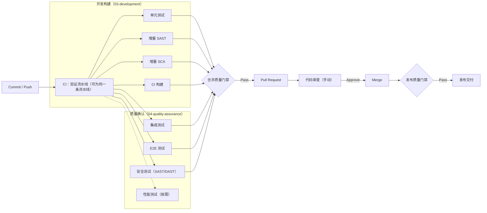

# 质量体系总览

## 自动化质量流程（CI/CD）

```mermaid
flowchart LR
  A[Commit / Push] --> PIPE[CI：验证流水线（可为同一条流水线）]

  subgraph DEV[开发构建（03-development）]
    PIPE --> UT[单元测试]
    PIPE --> SAST[增量 SAST]
    PIPE --> SCA[增量 SCA]
    PIPE --> BUILD[CI 构建]
  end

  subgraph QA[质量确认（04-quality-assurance）]
    PIPE --> IT[集成测试]
    PIPE --> E2E[E2E 测试]
    PIPE --> SEC[安全测试（SAST/DAST）]
    PIPE -.-> PERF[性能测试（按需）]
  end

  UT --> G1{合并质量门禁}
  SAST --> G1
  SCA --> G1
  BUILD --> G1
  IT --> G1
  E2E --> G1
  SEC --> G1

  G1 -->|Pass| PR[Pull Request]
  PR --> CR[代码审查（手动）]
  CR -->|Approve| MERGE[Merge]

  MERGE --> G2{发布质量门禁}
  G2 -->|Pass| REL[发布交付]
```

## 环节入口

- [开发构建（03-development）](03-development/)
- [质量确认（04-quality-assurance）](04-quality-assurance/)
