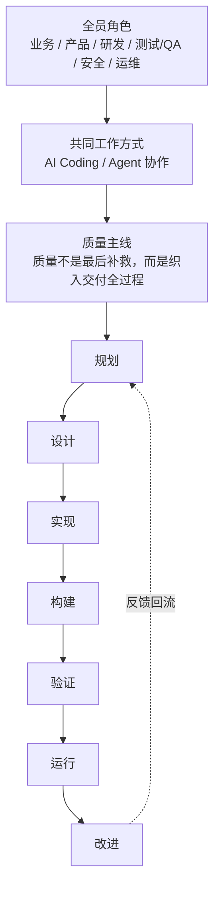
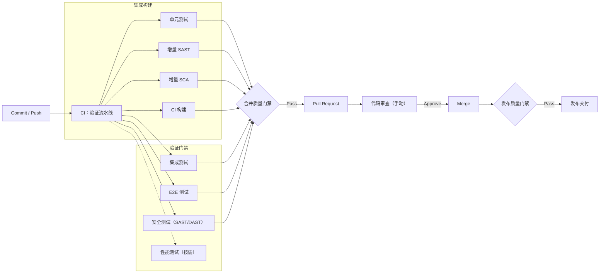

# 质量体系总览

本质量体系提供了一套完整、系统的规范、流程和指南，旨在贯穿软件交付的全生命周期，确保产品的高质量、高安全性和高可靠性。

## 一图理解：质量织入全员 AI Coding

每个人都用 AI 更快交付，也一起把质量带进每一步。

[查看页面版总览](00-overview/index.html)

- **AI 提升效率**，但不替代质量判断。
- **质量进入过程**，不是最后补救。
- **证据形成闭环**，让交付可信可追溯。

## 体系架构与组件

本体系按照模块化组织，主要包含以下核心组件。各组件相互协同，共同支撑整个质量保障体系：

### 1. 核心概念与治理 (01-concepts)
定义质量体系的基础，包括质量价值观、原则、方针以及治理规则和例外豁免机制。这是整个体系的“宪法”。
- [核心概念与治理](01-concepts/)

### 2. 交付生命周期阶段 (02-delivery-stages)
覆盖从需求规划到运营反馈的完整软件交付价值链，包含各阶段的定义及具体操作规程（Procedures）：
- [01-规划与变更](02-delivery-stages/01-plan-change/)：需求编写规程等。
- [02-设计与实现](02-delivery-stages/02-design-implement/)：架构评审、代码审查、编码规范、UI 设计规范等。
- [03-集成与构建](02-delivery-stages/03-integrate-build/)：持续集成（CI）规范等。
- [04-验证与门禁](02-delivery-stages/04-verify-gate/)：缺陷管理、测试策略及各类测试（集成、E2E、性能、安全）规程。
- [05-发布与部署](02-delivery-stages/05-release-deploy/)：变更管理与发布规程等。
- [06-运营与观测](02-delivery-stages/06-operate-observe/)：监控告警、故障响应、备份恢复等。
- [07-反馈与改进](02-delivery-stages/07-feedback-improve/)：复盘规程、内部审计与管理评审等。

### 3. 横向贯穿领域 (03-cross-cutting)
跨越所有交付阶段的横向支撑体系：
- **安全 (Security)**：访问控制、威胁建模、风险评估、安全编码等。
- **配置管理 (Configuration Management)**：分支策略等。
- **追溯性 (Traceability)**：需求到交付的全链路追溯。
- [横向贯穿领域](03-cross-cutting/)

### 4. 流水线验证机制 (04-pipeline-verification)
自动化质量流程与持续集成/持续部署（CI/CD）的验证标准与实现机制。
- [流水线验证机制](04-pipeline-verification/)

### 5. AI 辅助开发增强 (05-ai-coding-extension)
结合现代 AI 辅助编码工具（如 Trae、GitHub Copilot）的质量保障扩展与最佳实践。
- [AI 辅助开发增强](05-ai-coding-extension/)

### 6. 度量与指标 (06-metrics-reserved)
定义质量度量指标、数据看板和评价体系，用于驱动持续改进。
- [度量与指标](06-metrics-reserved/)

### 7. 标准合规追溯 (07-standard-traceability)
提供与行业标准（如 ISO 9001、ISO 27001）的合规性映射矩阵，确保过程合规。
- [标准合规追溯](07-standard-traceability/)

### 8. 模板库 (templates)
提供体系落地所需的各类标准化模板。
- [模板库](templates/)（包含：设计/需求评审清单、质量门禁清单、发布清单、测试用例及用户故事模板等）

---

## 自动化质量流程示例（CI/CD）

以下为本体系中自动化质量流程与门禁的参考示意图（详细机制见 `04-pipeline-verification`）：

